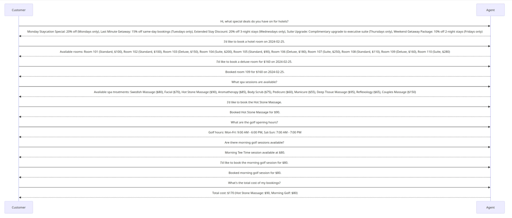

# AI-Powered Hospitality Booking Assistant
## Project Overview

The AI-Powered Hospitality Booking Assistant is an innovative application designed for AI Resorts, a fictitious hotel and spa company. This proof of concept (POC) demonstrates the integration of advanced AI technology into the hospitality industry, specifically for streamlining the booking process and enhancing customer service.

Our application allows customers to interact with an AI agent to effortlessly book hotel stays, golf sessions, and spa treatments in a single, cohesive experience. Additionally, the AI assistant provides valuable information about available treatments, special deals, and opening times, offering a comprehensive service that combines the efficiency of AI with the personalized touch of human-like interaction.

## Use Case Details

The primary use cases for this application in the hospitality domain include:

1. **Integrated Booking System**: 
   - Customers can book hotel rooms, golf sessions, and spa treatments in one seamless interaction.
   - The AI agent guides users through the booking process, suggesting available options and handling scheduling conflicts.

2. **Real-time Availability Checks**:
   - The system performs real-time checks on room availability, golf course schedules, and spa appointment slots.
   - It offers alternatives if the requested times or services are not available.

3. **Special Offers and Packages**:
   - The AI agent informs customers about current promotions, package deals, or seasonal offers that might be relevant to their booking.

4. **Information Queries**:
   - Customers can ask about specific spa treatments, golf course details, or hotel amenities.
   - The system provides up-to-date information on opening times, service descriptions, and pricing.

5. **Personalized Recommendations**:
   - Based on the customer's preferences or previous stays, the AI can recommend suitable room types, spa treatments, or golf packages.

6. **Booking Modifications and Cancellations**:
   - Assists customers in modifying existing bookings or processing cancellations, explaining policies as needed.

7. **FAQ and General Inquiries**:
   - Handles general questions about the resort, local attractions, or policies, reducing the load on human customer service staff.


## Interaction Sample with Agent

To better illustrate how our AI-powered booking assistant works in practice, here's an example interaction between a customer and the AI agent:

Customer: "Hi, what special deals do you have on at the moment for hotels?"

Agent: "The following hotel special deals are currently available:
- Monday Staycation Special: 20% off room rates (Mondays only)
- Last Minute Getaway: 15% off same-day bookings (Tuesdays only)
- Extended Stay Discount: 20% off 3-night stays (Wednesdays only)
- Suite Upgrade: Complimentary upgrade to executive suite (Thursdays only)
- Weekend Getaway Package: 10% off 2-night stays (Fridays only)"

Customer: "I would like to book a hotel room on the 2024-02-25, what is available?"

Agent: "Here are the available rooms on 2024-02-25:
- Room 101 (Standard, $100): Cozy standard room with a queen-sized bed.
- Room 102 (Standard, $100): Spacious standard room with two double beds.
- Room 103 (Deluxe, $150): Luxurious deluxe room with a king-sized bed and a view.
- Room 104 (Suite, $200): Elegant suite with a separate living area and bedroom.
- Room 105 (Standard, $90): [rest removed for brevity]"

Customer: "Can I book a deluxe please on 2024-02-25 for $160"

Agent: "I have booked room 109 for you on 2024-02-25. This is a deluxe room with a luxurious bathroom for $160. Please let me know if you need anything else!"

Customer: "What spa sessions are available?"

Agent: "Here are the available spa treatments for today:
- Swedish Massage: Relaxing full-body massage to relieve tension and promote relaxation. Cost: $80
- Facial: Deep cleansing facial to rejuvenate and refresh your skin. Cost: $70
- Hot Stone Massage: Therapeutic massage using heated stones to soothe muscles and improve circulation. Cost: $90
- Aromatherapy: Gentle massage using aromatic essential oils to enhance relaxation and well-being. Cost: $85
[rest removed for brevity]"

Customer: "Can I book the Hot Stone Massage please?"

Agent: "Yes, I have booked the Hot Stone Massage for you today. This therapeutic massage uses heated stones to soothe muscles and improve circulation. The cost is $90. Please let me know if you need anything else!"

Customer: "What are the opening hours for the golf?"

Agent: "The opening hours for golf at AI Resorts are:
Monday to Friday: 9:00 AM - 6:00 PM
Saturday & Sunday: 7:00 AM - 7:00 PM"

Customer: "Do you have any golf sessions on that day too in the morning?"

Agent: "Checking the available golf sessions for today, I see there is one morning session available: Morning Tee Time: Enjoy a round of golf in the morning with stunning views. Cost: $80. Please let me know if you would like me to book this morning golf session for you."

Customer: "Can I book the golf session for $80 on that day please?"

Agent: "Yes, I have booked the morning golf session for $80 today. This session will allow you to enjoy a round of golf in the morning with stunning views. Please let me know if you need anything else!"

Customer: "What was the total cost of my bookings?"

Agent: "Based on our conversation history, you have booked:
1. A deluxe hotel room for $160
2. A Hot Stone Massage for $90
3. A morning golf session for $80

The total cost of your bookings is $160 + $90 + $80 = $330."

This interaction demonstrates the AI agent's ability to:
- Provide information on special deals and available services
- Check real-time availability for rooms, spa treatments, and golf sessions
- Make bookings across different services (hotel, spa, golf)
- Answer queries about opening hours and other resort information
- Keep track of the customer's bookings and calculate the total cost

The AI agent seamlessly integrates with various backend systems to retrieve information and make bookings, providing a smooth and efficient experience for the customer. This automation significantly reduces the workload on human staff while offering personalized and comprehensive service to guests.

[](https://www.google.com/)



## Architecture

Our architecture is designed to provide a seamless, AI-driven booking experience while integrating with existing hospitality systems. Here's an overview of the key components:

The application follows a client-server architecture with real-time communication:

```
[Client (React)] <--WebSocket--> [Server (FastAPI)] <--> [LLM Service (Groq/OpenAI)]
```

### Key Components:

1. **Frontend (React)**:
   - Manages user interface and interactions
   - Handles WebSocket connections for real-time messaging
   - Implements responsive design for various devices

2. **Backend (FastAPI)**:
   - Provides WebSocket endpoint for real-time communication
   - Manages chat sessions and message routing
   - Integrates with LLM services (Groq and OpenAI)

3. **Database (PostgreSQL)**:
   - Stores chat history and user sessions
   - Utilizes pgvector for efficient storage and retrieval of vector embeddings

4. **LLM Service**:
   - Abstracts interactions with Groq (Llama) and OpenAI models
   - Handles prompt engineering and response generation

5. **Monitoring and Logging**:
   - Implements Prometheus for metrics collection
   - Uses Grafana for visualization of system and application metrics

## Technology Stack

### Frontend:
- **React**: A JavaScript library for building user interfaces
- **TypeScript**: Adds static typing to JavaScript for improved developer experience
- **Tailwind CSS**: A utility-first CSS framework for rapid UI development
- **WebSocket API**: For real-time, bi-directional communication with the server

### Backend:
- **FastAPI**: A modern, fast (high-performance) web framework for building APIs with Python
- **WebSockets**: For handling real-time connections
- **Pydantic**: Data validation and settings management using Python type annotations
- **SQLAlchemy**: SQL toolkit and Object-Relational Mapping (ORM) library

### Database:
- **PostgreSQL**: Open-source relational database
- **pgvector**: PostgreSQL extension for vector similarity search

### AI/ML:
- **Groq**: Integration with Groq's Llama model
- **OpenAI API**: Integration with OpenAI's language models

### DevOps & Monitoring:
- **Docker**: Containerization of the application
- **Prometheus**: Monitoring system and time series database
- **Grafana**: Analytics and interactive visualization web application

### Testing:
- **Jest**: JavaScript testing framework for React components
- **Pytest**: Testing framework for Python backend

## Detailed Design

### Frontend Design:

1. **Component Structure**:
   - `ChatInterface`: Main component orchestrating the chat experience
   - `MessageList`: Renders the list of chat messages
   - `MessageItem`: Individual message component
   - `InputArea`: Handles user input and message sending
   - `ModelSelector`: Allows users to switch between AI models

2. **State Management**:
   - Uses React hooks (`useState`, `useEffect`, `useCallback`) for local state management
   - Custom `useWebSocket` hook for managing WebSocket connections and messages

3. **Styling**:
   - Utilizes Tailwind CSS for responsive and customizable UI
   - Implements a light/dark mode toggle for user preference

4. **Error Handling**:
   - Implements error boundaries to catch and display runtime errors
   - Provides user-friendly error messages for connection issues or API errors

### Backend Design:

1. **API Structure**:
   - WebSocket endpoint `/ws/chat` for real-time messaging
   - RESTful endpoints for user authentication and session management

2. **Middleware**:
   - CORS middleware to handle cross-origin requests
   - Authentication middleware to secure API endpoints

3. **Services**:
   - `LLMService`: Abstracts interactions with Groq and OpenAI
   - `ChatService`: Manages chat sessions and message persistence
   - `UserService`: Handles user-related operations

4. **Database Schema**:
   - `users`: Stores user information
   - `chat_sessions`: Manages active chat sessions
   - `messages`: Stores individual chat messages with vector embeddings

5. **Caching**:
   - Implements Redis for caching frequent queries and session data

### LLM Integration:

1. **Model Selection**:
   - Dynamically selects between Groq (Llama) and OpenAI based on user preference
   - Implements a fallback mechanism if the primary model is unavailable

2. **Prompt Engineering**:
   - Designs effective prompts for different use cases (e.g., customer support, educational queries)
   - Implements prompt templates for consistency across interactions

3. **Response Processing**:
   - Filters and sanitizes AI-generated responses
   - Implements content moderation to ensure appropriate responses

### Monitoring and Logging:

1. **Metrics Collection**:
   - Tracks system metrics (CPU, memory, network)
   - Monitors application-specific metrics (request rate, response time, error rate)

2. **Logging**:
   - Implements structured logging for easier parsing and analysis
   - Uses log levels to differentiate between debug, info, warning, and error logs

3. **Alerting**:
   - Sets up alerts for critical errors and performance thresholds
   - Integrates with notification systems (e.g., email, Slack) for immediate attention

## Setup and Installation

(Provide detailed steps for setting up the development environment, including prerequisites, dependency installation, and configuration.)

## Usage

(Explain how to run the application, including any command-line options or environment variables.)
