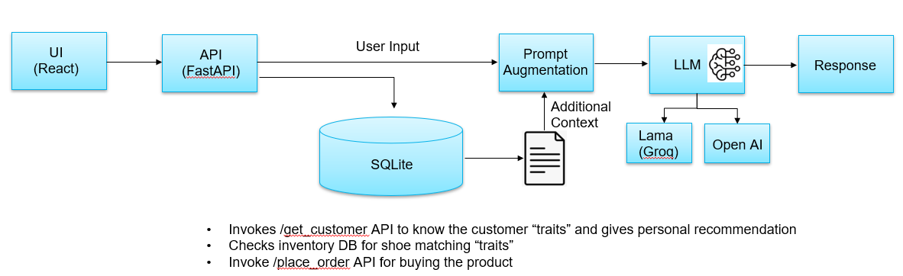

# Retail Bot: AI-Powered Shoe Store Assistant

A modern, AI-powered retail chatbot that helps customers find and purchase shoes. Built with FastAPI, LangChain, and React, utilizing Groq and OpenAI's language models.

## Features

### Functional Features
- 🤖 Natural language interaction with customers
- 👟 Comprehensive shoe inventory management
- 🔍 Smart product recommendations
- 📊 Real-time stock availability
- 💰 Price comparisons and information
- 🛒 Order processing capability

### Technical Features
- ⚡ Async API with FastAPI
- 🔄 WebSocket support for real-time chat
- 🧠 LangChain for LLM orchestration
- 🔄 Fallback mechanisms between Groq and OpenAI
- 🗄️ SQLite database for data persistence
- 🧪 Comprehensive test suite

## Architecture



## Project Structure
```
retail_agent/
├── backend/            # FastAPI backend
│   ├── app/
│   │   ├── main.py    # Main application
│   │   ├── agents.py  # LangChain agents
│   │   ├── db.py      # Database operations
│   │   ├── models.py  # Pydantic models
│   │   └── config.py  # Configuration
│   ├── tests/         # Test suite
│   └── requirements.txt
└── database/          # SQLite database
```

## Setup Instructions

### Prerequisites
- Python 3.9+
- pip
- Virtual environment tool

### Environment Setup

1. Clone the repository:
```bash
git clone [repository-url]
cd retail-agent
```

2. Create and activate virtual environment:
```bash
# Windows
python -m venv venv
.\venv\Scripts\activate

# Unix/MacOS
python -m venv venv
source venv/bin/activate
```

3. Create .env file:
```bash
cp .env.example .env
```

4. Update .env with your API keys:
```env
GROQ_API_KEY=your_groq_api_key
OPENAI_API_KEY=your_openai_api_key
```

### Installation

1. Install dependencies:
```bash
cd backend
pip install -r requirements.txt
```

2. Initialize the database:
```bash
# The database will be automatically initialized on first run
```

### Running the Application

1. Start the backend server:
```bash
uvicorn app.main:app --reload
```

2. Test the API:
```bash
curl http://localhost:8000/health
```

## Testing

### Running Tests

1. Install test dependencies:
```bash
pip install pytest pytest-asyncio aiohttp
```

2. Run the test suite:
```bash
python test_retail_bot.py
```

3. Run load tests:
```bash
python load_test_retail_bot.py
```

## API Documentation

### Chat Endpoints

1. WebSocket Chat:
```bash
ws://localhost:8000/ws/chat
```

2. REST Chat:
```bash
POST /api/chat
Content-Type: application/json

{
    "content": "What running shoes do you have?"
}
```

### Inventory Endpoints

1. Get All Inventory:
```bash
GET /api/inventory
```

2. Get Filtered Inventory:
```bash
GET /api/inventory?activity=running&size=10
```

## Example Usage

1. Basic Query:
```bash
curl -X POST "http://localhost:8000/api/chat" \
  -H "Content-Type: application/json" \
  -d '{"content": "What shoes do you have?"}'
```

2. Specific Query:
```bash
curl -X POST "http://localhost:8000/api/chat" \
  -H "Content-Type: application/json" \
  -d '{"content": "I need running shoes in size 10"}'
```


## Pre-initialized Database

### Product Inventory
The system is initialized with the following shoe inventory:

```sql
-- Pre-initialized Inventory
| ID | Name             | Activity | Size | Price  | Stock |
|----|------------------|----------|------|--------|-------|
| 1  | Speed Runner Pro | running  | 10   | 129.99 | 5     |
| 2  | Speed Runner Pro | running  | 9    | 129.99 | 3     |
| 3  | Speed Runner Pro | running  | 11   | 129.99 | 2     |
| 4  | Trail Blazer X   | hiking   | 10   | 159.99 | 4     |
| 5  | Trail Blazer X   | hiking   | 9    | 159.99 | 3     |
| 6  | Comfort Walker   | walking  | 10   | 89.99  | 6     |
| 7  | Comfort Walker   | walking  | 11   | 89.99  | 4     |
| 8  | Marathon Elite   | running  | 10   | 149.99 | 3     |
| 9  | Mountain Explorer| hiking   | 10   | 179.99 | 2     |
| 10 | Daily Walker Plus| walking  | 10   | 99.99  | 5     |
```

## Example Conversations with Bot

### 1. Basic Inventory Query
```plaintext
User: "What shoes do you have?"
Bot: "Here are our available shoes:

Running Shoes:
- Speed Runner Pro, Size 10, $129.99 (5 in stock)
- Marathon Elite, Size 10, $149.99 (3 in stock)

Walking Shoes:
- Comfort Walker, Size 10, $89.99 (6 in stock)
- Daily Walker Plus, Size 10, $99.99 (5 in stock)

Hiking Shoes:
- Trail Blazer X, Size 10, $159.99 (4 in stock)
- Mountain Explorer, Size 10, $179.99 (2 in stock)

Would you like more information about any specific shoe?"
```

### 2. Activity-Specific Query
```plaintext
User: "Show me running shoes"
Bot: "Here are our running shoes:
- Speed Runner Pro (Available in sizes 9, 10, 11)
  Price: $129.99, Stock: 5 pairs in size 10
- Marathon Elite (Size 10)
  Price: $149.99, Stock: 3 pairs

Would you like to know more about any of these shoes?"
```

### 3. Size and Activity Combined Query
```plaintext
User: "I need running shoes in size 10"
Bot: "I found two running shoes in size 10:
1. Speed Runner Pro - $129.99 (5 pairs in stock)
   Perfect for daily running and training
2. Marathon Elite - $149.99 (3 pairs in stock)
   Ideal for long-distance running

Would you like more details about either of these shoes?"
```

### 4. Product Comparison Flow
```plaintext
User: "What's the difference between Speed Runner Pro and Marathon Elite?"
Bot: "Let me compare these running shoes for you:

Speed Runner Pro ($129.99):
- Best for daily training and general running
- More cushioning for comfort
- 5 pairs available in size 10

Marathon Elite ($149.99):
- Specialized for long-distance running
- Enhanced stability features
- 3 pairs available in size 10

The main difference is that the Marathon Elite is $20 more expensive but offers additional features for long-distance running. Which aspects are most important for your needs?"
```

### 5. Price Range Query
```plaintext
User: "What are your most affordable running shoes?"
Bot: "Looking at our running shoe collection:
1. Speed Runner Pro - $129.99 (Most affordable running option)
2. Marathon Elite - $149.99

Both are quality running shoes, with the Speed Runner Pro being the more budget-friendly option. Would you like to know more about either of these?"
```

## Test Cases Overview

Our test suite covers various conversation scenarios and edge cases:

### 1. Basic Queries Test
Tests simple, straightforward questions:
- General inventory queries
- Activity-specific queries
- Size-specific queries

### 2. Complex Queries Test
Tests multi-parameter questions:
- Combined activity and size queries
- Price comparison requests
- Stock availability checks

### 3. Edge Cases Test
Tests unusual or boundary scenarios:
- Unavailable sizes (e.g., size 99)
- Unknown activities (e.g., swimming shoes)
- Out-of-stock situations

### 4. Conversation Flow Test
Tests a complete purchase journey:
```plaintext
Step 1: Initial Inquiry
User: "What running shoes do you have?"
Expected: List of running shoes with prices and stock

Step 2: Product Interest
User: "Tell me more about the Speed Runner Pro"
Expected: Detailed product information

Step 3: Size Check
User: "Do you have it in size 10?"
Expected: Size availability and stock information

Step 4: Comparison
User: "How does it compare to the Marathon Elite?"
Expected: Comparison of features and prices

Step 5: Recommendation
User: "Which one would you recommend for marathon training?"
Expected: Specific recommendation with reasoning

Step 6: Purchase Intent
User: "I'll take the Speed Runner Pro"
Expected: Order confirmation or next steps
```

### 5. Manual Test Scenarios

#### Price Comparison Test
```plaintext
Test: "What's the price difference between Speed Runner Pro and Marathon Elite?"
Expected: Clear price comparison with the $20 difference explained
```

#### Stock Availability Test
```plaintext
Test: "Which running shoes are currently in stock?"
Expected: List of available running shoes with stock levels
```

#### Recommendation Test
```plaintext
Test: "I'm a beginner looking for comfortable walking shoes"
Expected: Suggestion of Comfort Walker with its features and price
```

## Response Analysis

Our test suite analyzes bot responses for:
- Price information ($ symbol)
- Size information (size numbers)
- Stock availability ("in stock")
- Shoe names (product recognition)
- Activity types (running/walking/hiking)
- Helpfulness (meaningful content)
- Alternative suggestions
- Error handling


## Troubleshooting

Common issues and solutions:

1. Database Issues:
   - Delete the existing database file and restart the application
   - Check database permissions

2. API Key Issues:
   - Verify API keys in .env file
   - Check API key permissions

3. Test Failures:
   - Ensure all dependencies are installed
   - Check test database connectivity
   - Verify API is running for integration tests

## Contributing

1. Fork the repository
2. Create your feature branch
3. Add tests for any new functionality
4. Ensure tests pass
5. Create a pull request
